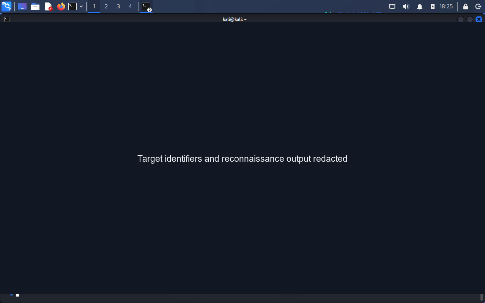
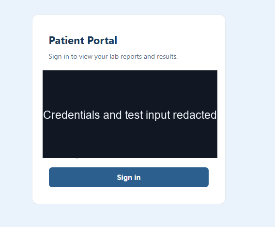
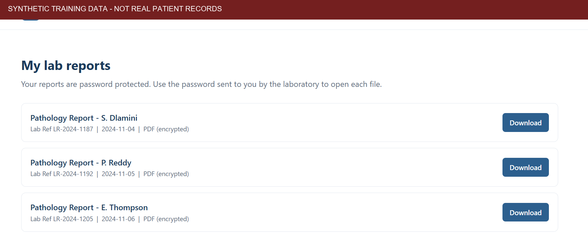
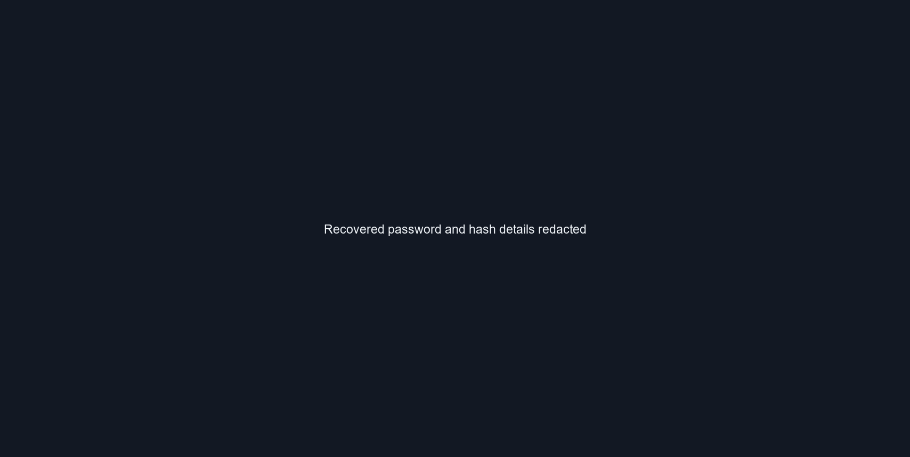
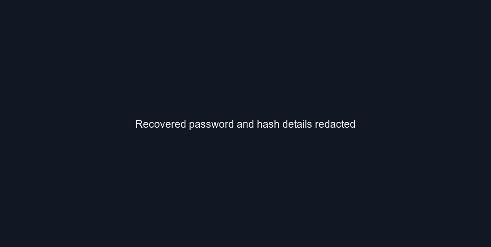
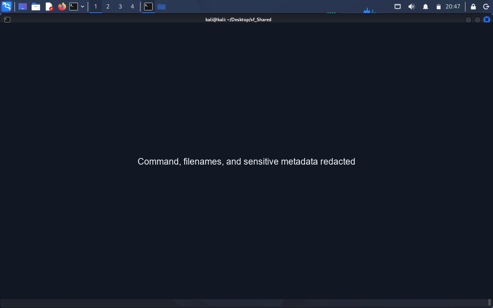
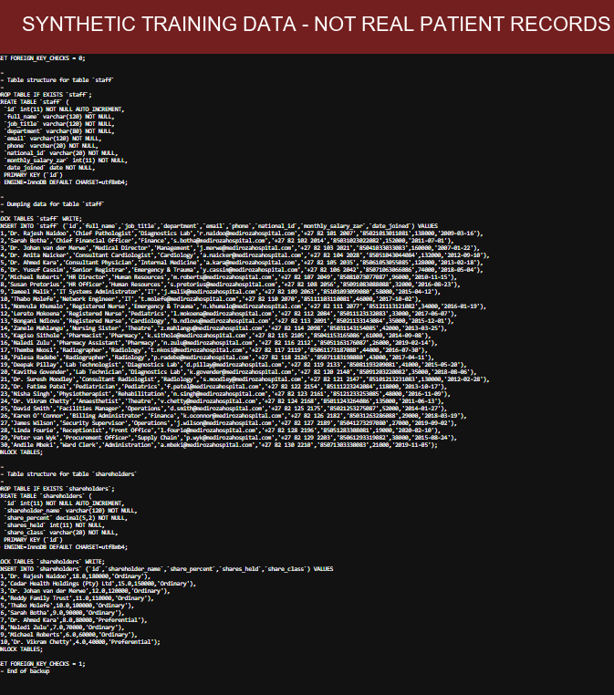

# Week 3 Security Assessment — Public Summary

> **Public-safe edition:** The source report contains target-identifying information, patient data, authentication evidence, and database contents. Sensitive details have been redacted from this README and its evidence images. This is a public-safe summary, not the original report.

## Assessment overview

A black-box security assessment was conducted in an authorized training context against a web application. The report describes issues spanning authentication and access control, sensitive data exposure, document-password strength, and information disclosure.

## Reported risk areas

- Authentication and access-control weaknesses
- Exposure of sensitive files or data
- Weak protection for encrypted documents
- Excessive information disclosure through paths, directory listings, account feedback, or error messages

Target identifiers, submitted credentials, recovered passwords, hashes, and sensitive metadata are redacted. Technical exploit steps are omitted. Portal and database screenshots labeled as synthetic are included as training evidence.

## Recommended remediation

- Use parameterized queries and enforce authorization checks on every sensitive operation.
- Remove exposed backups and restrict access to sensitive files and directories.
- Require strong, unique passwords for protected documents and rotate any potentially exposed credentials.
- Disable directory listings and avoid disclosing sensitive paths.
- Use generic authentication errors and disable verbose database errors in production.
- Add multi-factor authentication, a web application firewall, ongoing security testing, and secure-development practices.

## Responsible disclosure

The original report is classified confidential. Keep the unredacted report and any evidence in a private, access-controlled location; share technical details only with the system owner and authorized responders.
## Report Evidence Images

The following figures are included for the assignment. The portal and database screenshots are marked as synthetic training data, as confirmed by the author. Target details, submitted credentials, recovered passwords, hashes, and sensitive metadata are redacted.

### Reconnaissance

### Login test

### Portal screenshot (synthetic records)

### Password-cracking evidence (secrets redacted)

### Metadata inspection

### Database screenshot (synthetic records)

